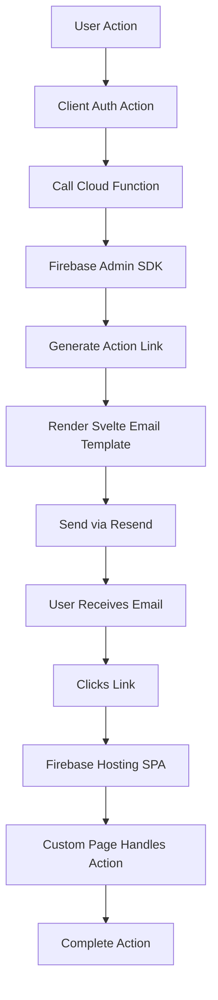

# Custom Email System with Resend and Svelte Email (Firebase Hosting)

## Overview

Replace Firebase default emails with custom Svelte Email templates sent via Resend. Deploy SPA to Firebase Hosting and use Firebase Cloud Functions for email sending. Everything runs on Firebase platform for seamless integration.

## Architecture




## User Actions Required (Do These First)

### 1. Install Firebase CLI

- Run: `npm install -g firebase-tools`
- Login: `firebase login`
- Verify installation: `firebase --version`

### 2. Initialize Firebase Project

- Run `firebase init` in project root
- Select:
- **Hosting** - Configure files for Firebase Hosting
- **Functions** - Configure a Cloud Functions directory and files
- When prompted:
- Use existing Firebase project (select your project)
- Public directory: `build` (matches adapter-static output)
- Configure as single-page app: **Yes**
- Set up automatic builds: **No** (we'll build manually)
- Functions language: **TypeScript**
- Use ESLint: **Yes**
- Install dependencies: **Yes**

### 3. Create Resend Account

- Sign up at https://resend.com
- Generate API key from dashboard
- Set in Firebase Functions config:
  ```bash
          firebase functions:config:set resend.api_key="re_xxx"
  ```


- For local development, create `functions/.env`:
  ```javascript
          RESEND_API_KEY=re_xxx
  ```


- Verify domain in Resend dashboard (for production)
- Use Resend test domain (`onboarding@resend.dev`) for development

### 4. Set Environment Variables

**Client-side (Development):**

- Add to `.env` file in project root:
  ```javascript
          PUBLIC_APP_URL=http://localhost:5173
  ```


**Client-side (Production):**

- Set in Firebase Console → Hosting → Environment variables
- Add `PUBLIC_APP_URL` = `https://yourdomain.com`

**Server-side (Functions):**

- Already configured via `firebase functions:config:set` (step 3)

### 5. Verify Domain in Resend (Production Only)

- Add your domain in Resend dashboard
- Add DNS records as instructed
- Verify domain (required for production emails)

### 6. Configure Firebase Authentication (After Implementation)

- In Firebase Console → Authentication → Templates
- For each template (Email verification, Password reset, Email change):
- Option 1: Disable completely (recommended for production)
- Option 2: Keep enabled but customize action URL to point to your custom pages
- Action URL format: `{PUBLIC_APP_URL}/verify-email/confirm` (for verification)

### 7. Deploy (After Implementation)

- Build: `npm run build`
- Deploy: `firebase deploy`
- Test all email flows

---

## Phase 1: Firebase Setup & Configuration

### 1.1 Firebase Configuration Files

Create/Update `firebase.json`:

```json
{
  "hosting": {
    "public": "build",
    "ignore": [
      "firebase.json",
      "**/.*",
      "**/node_modules/**"
    ],
    "rewrites": [
      {
        "source": "**",
        "destination": "/200.html"
      }
    ],
    "headers": [
      {
        "source": "**/*.@(js|css|png|jpg|jpeg|gif|ico|svg|woff|woff2|ttf|eot)",
        "headers": [
          {
            "key": "Cache-Control",
            "value": "max-age=31536000"
          }
        ]
      }
    ]
  },
  "functions": {
    "source": "functions",
    "predeploy": [
      "npm --prefix \"$RESOURCE_DIR\" run build"
    ]
  }
}
```

Create/Update `.firebaserc`:

```json
{
  "projects": {
    "default": "your-firebase-project-id"
  }
}
```


### 1.2 Firebase Cloud Functions Setup

- Functions directory structure will be created by `firebase init`
- Configure `functions/package.json` with dependencies:
- `firebase-admin` - Admin SDK for action link generation
- `firebase-functions` - Functions runtime
- `resend` - Resend SDK
- `@sveltejs/email` - Svelte Email framework
- `svelte` - For rendering templates
- TypeScript dependencies

### 1.3 Environment Variables Setup

**Client-side (Public):**

- Create `src/lib/config.ts`:
  ```typescript
          import { PUBLIC_APP_URL } from '$env/static/public';
          export const APP_URL = PUBLIC_APP_URL || 'http://localhost:5173';
  ```


**Server-side (Functions):**

- Use Firebase Functions config for secrets:
- `resend.api_key` - Resend API key (set via `firebase functions:config:set`)
- `app.url` - Production URL (optional, can be hardcoded)
- Access in functions: `functions.config().resend.api_key`

## Phase 2: Email Templates (Svelte Email)

### 2.1 Install Dependencies

**Root project (`package.json`):**

- `@sveltejs/email` - For developing templates locally (optional, but helpful)

**Functions (`functions/package.json`):**

- `@sveltejs/email` - Svelte Email framework
- `resend` - Resend SDK
- `svelte` - For rendering templates
- `firebase-admin` - Admin SDK
- `firebase-functions` - Functions runtime

### 2.2 Create Email Template Structure

Create `src/lib/emails/templates/` with:

- `EmailVerification.svelte` - Email verification (signup)
- `Welcome.svelte` - Welcome email (after verification)
- `PasswordReset.svelte` - Password reset request
- `PasswordChanged.svelte` - Password changed confirmation
- `PasswordSet.svelte` - Password set (Google user)
- `EmailChangeVerification.svelte` - Email change verification
- `EmailChanged.svelte` - Email changed notification (old email)
- `AccountDeleted.svelte` - Account deleted confirmation

### 2.3 Create Base Email Component

- `src/lib/emails/components/EmailLayout.svelte` - Base layout with header/footer
- `src/lib/emails/components/Button.svelte` - Styled button component
- Shared styling and branding (consistent with app design)

### 2.4 Email Template Props Interface

Create `src/lib/emails/types.ts` with TypeScript interfaces for each email's props:

- `EmailVerificationProps` - email, verificationLink
- `WelcomeProps` - name, email
- `PasswordResetProps` - email, resetLink
- `PasswordChangedProps` - email
- `PasswordSetProps` - email
- `EmailChangeVerificationProps` - email, newEmail, verificationLink
- `EmailChangedProps` - oldEmail, newEmail
- `AccountDeletedProps` - email

## Phase 3: Cloud Functions Implementation

### 3.1 Functions Structure

Create `functions/src/`:

- `emails/sendEmail.ts` - Main email sending utility
- `emails/renderTemplate.ts` - Svelte Email template renderer
- `emails/types.ts` - Shared types matching client types
- `emails/actionLinks.ts` - Firebase action link generation helpers
- `index.ts` - Export all callable functions

### 3.2 Firebase Admin SDK Initialization

In `functions/src/index.ts`:

```typescript
import * as admin from 'firebase-admin';
admin.initializeApp();
```


### 3.3 Email Sending Functions

Create callable functions (HTTP callable):

- `sendEmailVerification` - Verification emails (signup)
- `sendWelcomeEmail` - Welcome email (after verification)
- `sendPasswordReset` - Password reset request
- `sendPasswordChanged` - Password changed confirmation
- `sendPasswordSet` - Password set (Google user)
- `sendEmailChangeVerification` - Email change verification
- `sendEmailChanged` - Email changed notification (old email)
- `sendAccountDeleted` - Account deleted confirmation

### 3.4 Action Link Generation

Each function will:

1. Receive user email and action type from client
2. Generate Firebase action link using Admin SDK:

- `admin.auth().generateEmailVerificationLink(email)` for verification
- `admin.auth().generatePasswordResetLink(email)` for password reset
- `admin.auth().generateEmailVerificationLink(newEmail)` for email change

3. Build full URL: `{APP_URL}/reset-password/confirm?oobCode=...&mode=resetPassword`
4. Render Svelte Email template with props
5. Send via Resend API

### 3.5 Template Rendering

Create `functions/src/emails/renderTemplate.ts`:

- Import Svelte Email templates (copy to `functions/src/emails/templates/` or use shared path)
- Use `@sveltejs/email` render function
- Return HTML string for Resend

## Phase 4: Update Auth Actions

### 4.1 Modify `src/lib/auth/actions.ts`

Replace Firebase email sending with Cloud Function calls:

- `signupWithEmail()` - After creating user, call `sendEmailVerification` Cloud Function
- `resetPassword()` - Call `sendPasswordReset` Cloud Function instead of `sendPasswordResetEmail()`
- `sendVerificationEmail()` - Call `sendEmailVerification` Cloud Function
- Add new actions:
- `changeEmail(newEmail: string)` - Call `sendEmailChangeVerification` Cloud Function
- `deleteAccount()` - Call `sendAccountDeleted` Cloud Function, then delete user

### 4.2 Create Auth Email Service

Create `src/lib/auth/email.ts`:

- `callCloudFunction(name: string, data: unknown)` - Generic Cloud Function caller
- `sendEmailVerificationEmail(email: string)` - Wrapper for verification
- `sendPasswordResetEmail(email: string)` - Wrapper for password reset
- `sendWelcomeEmail(email: string)` - Called after email verification
- Helper functions use `httpsCallable` from `firebase/functions`

### 4.3 Firebase Functions Client Setup

Update `src/lib/firebase/config.ts`:

- Import `getFunctions` from `firebase/functions`
- Export `functions` instance for calling Cloud Functions
- Use same Firebase app instance

## Phase 5: Custom Pages

### 5.1 Password Reset Confirmation Page

Create `src/routes/(public)/(auth)/reset-password/confirm/+page.svelte`:

- Extract `oobCode` and `mode` from URL query params
- Show password reset form (new password + confirm)
- Use existing `verifyPasswordResetCode()` and `confirmPasswordReset()` from actions
- After successful reset, call `sendPasswordChanged` Cloud Function
- Show success message and redirect to login

### 5.2 Email Verification Confirmation Page

Create `src/routes/(public)/(auth)/verify-email/confirm/+page.svelte`:

- Extract `oobCode` and `mode` from URL query params
- Verify email using Firebase `applyActionCode()` from `firebase/auth`
- Show success message
- Call `sendWelcomeEmail` Cloud Function
- Redirect to app (or login if not authenticated)

### 5.3 Email Change Confirmation Page

Create `src/routes/(public)/(auth)/change-email/confirm/+page.svelte`:

- Extract `oobCode` and `mode` from URL query params
- Verify email change using Firebase `applyActionCode()`
- Call `sendEmailChanged` Cloud Function (sends to old email)
- Show success message
- Redirect to app

## Phase 6: Integration Points

### 6.1 Update Signup Flow

In `src/routes/(public)/(auth)/signup/+page.svelte`:

- After signup, redirect to verify-email page (no change needed)
- Verification email sent via Cloud Function automatically in `signupWithEmail()`

### 6.2 Update Verify Email Page

In `src/routes/(public)/(auth)/verify-email/+page.svelte`:

- Update "Resend Verification Email" button to call Cloud Function
- Keep polling logic for auto-redirect when verified

### 6.3 Update Reset Password Page

In `src/routes/(public)/(auth)/reset-password/+page.svelte`:

- Update to use Cloud Function for sending reset email
- Update success message

### 6.4 Add Email Change Flow

Create `src/routes/(protected)/app/settings/+page.svelte`:

- Form to request email change (enter new email)
- Call `changeEmail()` action
- Show success message ("Check your new email inbox")

### 6.5 Add Account Deletion Flow

In settings page:

- Add "Delete Account" section
- Show confirmation dialog
- Call `deleteAccount()` action
- Sign out user after deletion

## Phase 7: Firebase Configuration

### 7.1 Disable Firebase Default Emails

In Firebase Console:

- Go to Authentication → Templates
- For each template (Email verification, Password reset, Email change):
- Option 1: Disable completely (recommended for production)
- Option 2: Keep enabled but customize action URL to point to your custom pages
- Action URL format: `{PUBLIC_APP_URL}/verify-email/confirm` (for verification)

### 7.2 Action URL Configuration

In Firebase Console → Authentication → Settings → Authorized domains:

- Ensure your production domain is added
- For localhost, add `localhost` (usually already there)

### 7.3 Firebase Hosting Environment Variables

In Firebase Console → Hosting → Environment variables:

- Add `PUBLIC_APP_URL` = `https://yourdomain.com` (for production)
- Variables are available at build time

## Phase 8: Deployment

### 8.1 Build Process

```bash
# Build SvelteKit app
npm run build

# Deploy everything (hosting + functions)
firebase deploy

# Or deploy separately
firebase deploy --only hosting
firebase deploy --only functions
```


### 8.2 Pre-deployment Checklist

- [ ] Resend API key set in Functions config
- [ ] `PUBLIC_APP_URL` set for production
- [ ] Firebase project selected in `.firebaserc`
- [ ] Functions dependencies installed (`cd functions && npm install`)
- [ ] All email templates created
- [ ] Custom pages created and tested locally

### 8.3 Production Deployment Steps

1. Update `PUBLIC_APP_URL` in Firebase Hosting environment variables
2. Build: `npm run build`
3. Deploy: `firebase deploy`
4. Verify:

- Hosting URL works (SPA routing)
- Functions are callable
- Emails are sent correctly
- Action links work

### 8.4 Custom Domain Setup

1. In Firebase Console → Hosting → Add custom domain
2. Add your domain (e.g., `app.example.com`)
3. Add DNS records as instructed
4. Wait for SSL certificate provisioning
5. Update `PUBLIC_APP_URL` to custom domain
6. Redeploy: `firebase deploy --only hosting`

## Files to Create/Modify

### New Files:

- `firebase.json` - Firebase Hosting + Functions configuration
- `.firebaserc` - Firebase project configuration
- `functions/package.json` - Functions dependencies
- `functions/tsconfig.json` - Functions TypeScript config
- `functions/.eslintrc.js` - Functions ESLint config
- `functions/src/index.ts` - Functions entry point
- `functions/src/emails/sendEmail.ts` - Email sending utility
- `functions/src/emails/renderTemplate.ts` - Template renderer
- `functions/src/emails/actionLinks.ts` - Action link helpers
- `functions/src/emails/types.ts` - Email types
- `functions/src/emails/templates/*.svelte` - Email templates (copy from src/lib/emails/templates)
- `src/lib/emails/templates/EmailVerification.svelte`
- `src/lib/emails/templates/Welcome.svelte`
- `src/lib/emails/templates/PasswordReset.svelte`
- `src/lib/emails/templates/PasswordChanged.svelte`
- `src/lib/emails/templates/PasswordSet.svelte`
- `src/lib/emails/templates/EmailChangeVerification.svelte`
- `src/lib/emails/templates/EmailChanged.svelte`
- `src/lib/emails/templates/AccountDeleted.svelte`
- `src/lib/emails/components/EmailLayout.svelte`
- `src/lib/emails/components/Button.svelte`
- `src/lib/emails/types.ts`
- `src/lib/auth/email.ts` - Cloud Function callers
- `src/lib/config.ts` - App configuration (APP_URL)
- `src/routes/(public)/(auth)/reset-password/confirm/+page.svelte`
- `src/routes/(public)/(auth)/verify-email/confirm/+page.svelte`
- `src/routes/(public)/(auth)/change-email/confirm/+page.svelte`
- `src/routes/(protected)/app/settings/+page.svelte`

### Modified Files:

- `src/lib/auth/actions.ts` - Replace Firebase email calls with Cloud Functions
- `src/lib/firebase/config.ts` - Add Functions instance export
- `src/routes/(public)/(auth)/signup/+page.svelte` - (minimal changes)
- `src/routes/(public)/(auth)/verify-email/+page.svelte` - Update resend function
- `src/routes/(public)/(auth)/reset-password/+page.svelte` - Update send function
- `package.json` - Add @sveltejs/email (optional, for local template dev)
- `.env` - Add PUBLIC_APP_URL
- `.gitignore` - Add `functions/.env`, `functions/lib`, `functions/node_modules`

## Implementation Order

1. **Firebase Setup** - Initialize Firebase project, create config files
2. **Email Templates** - Create all Svelte Email templates
3. **Cloud Functions** - Implement email sending functions
4. **Auth Integration** - Update auth actions to call Cloud Functions
5. **Custom Pages** - Create confirmation pages
6. **Testing** - Test all flows locally (use Firebase emulators)
7. **Deployment** - Deploy to Firebase Hosting + Functions
8. **Production Config** - Set production URLs, verify domain

## Notes

- Firebase Hosting serves static files from `build` directory
- Cloud Functions run server-side with Admin SDK access
- Svelte Email templates compile to HTML strings in Functions
- All email sending happens server-side (secure API keys)
- Action links include full URLs (localhost or production domain)
- Firebase Hosting automatically handles SSL and CDN
- Functions can be tested locally with Firebase emulators
- Use Firebase Hosting environment variables for build-time config
- Functions config is for runtime secrets (Resend API key)

## Firebase Emulators (Local Development)

For local testing:

```bash
# Start emulators
firebase emulators:start

# Functions will be available at http://localhost:5001
# Update client to use emulator:
# functions.useEmulator('localhost', 5001)


```